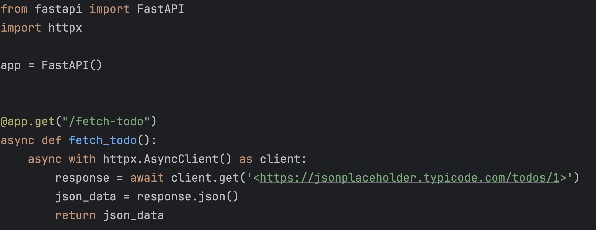
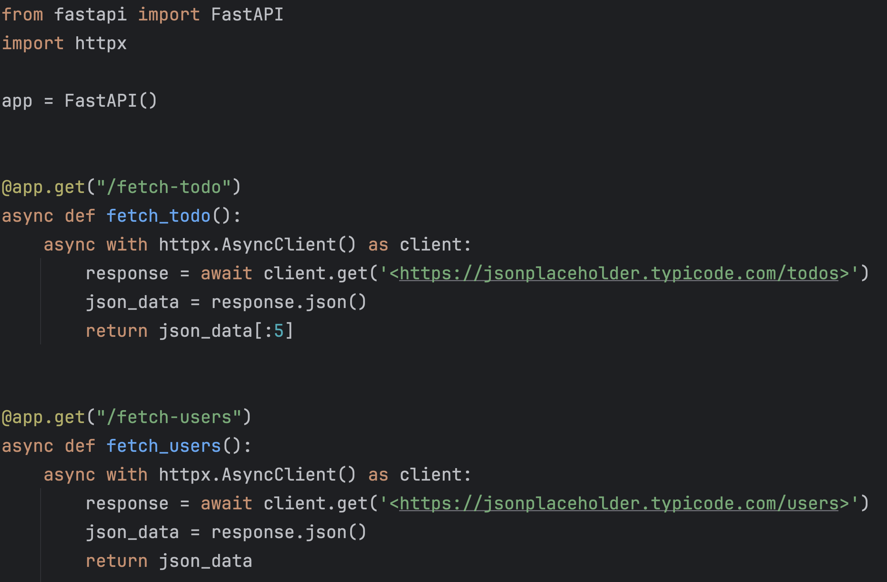
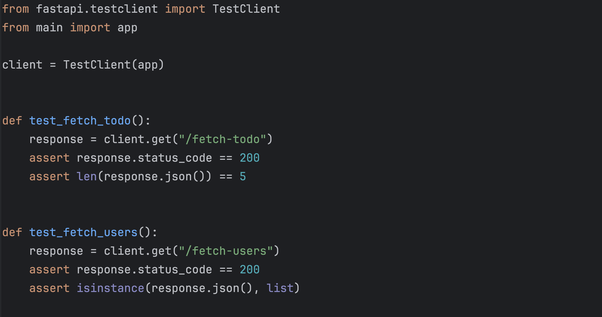

# **Create and Edit Software**
I think a realistic version of an AI Engineer is to also allow it to edit already existing code.  You won't always be creating new code the way you want, and you will probably have to adhere to how existing code is written.

## Imports Needed:
- pyautogen

## YouTube Link:
- [Accelerate Software Creation with AI Agents: Quick Tutorial](https://youtu.be/tT-I0ImNcQ0)

## Updates:
- 06/02/2024: Added README

---

### Before:

---

### After:

### After With Tests:

